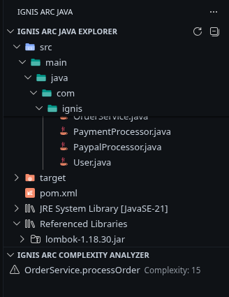
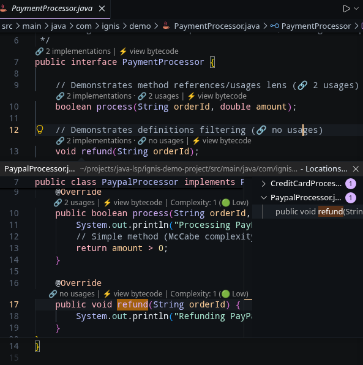
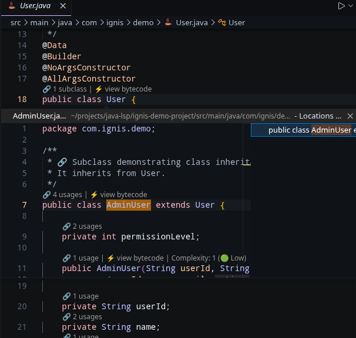
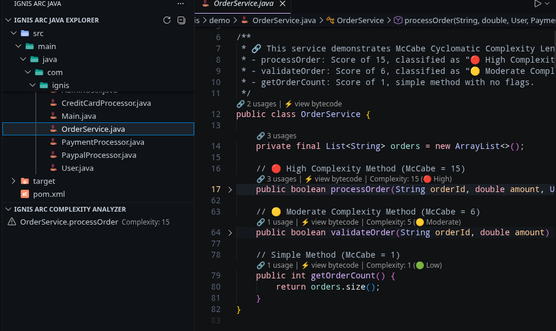
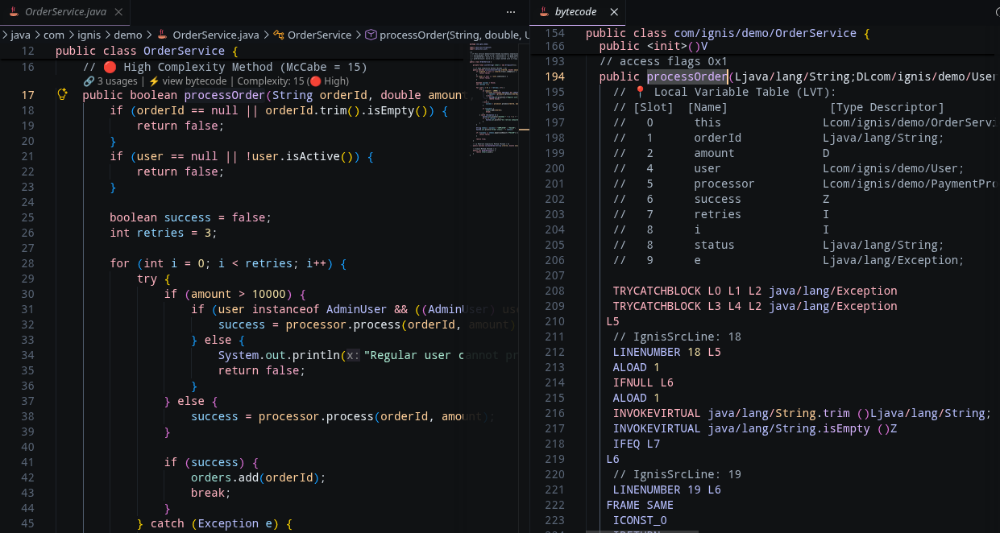

# Ignis Arc Java IDE Extension Pack (焱虹 Java IDE 擴充包)

[](https://github.com/Ignis-Arc/ignis-arc-java-ide-extension)
[](LICENSE)
[](https://code.visualstudio.com/)

這是一款為 VS Code 量身打造的頂級 Java 開發強化套件。結合了重量級 IDE (IntelliJ IDEA / Eclipse) 級別的**專案樹導航、外部依賴庫瀏覽、OOP 引用計數與實現追蹤、程式碼複雜度巡檢、以及位元碼極致調優套件**，為您提供無比流暢、輕量且精緻的 Java 開發體驗，且**完全不佔用額外背景 JVM 進程記憶體開銷**。

---

> [!IMPORTANT]  
> **擴充套件依賴與協同處理說明：**  
> 本套件做為高性能開發輔助包，嚴格依賴於 **[Language Support for Java(TM) by Red Hat](https://marketplace.visualstudio.com/items?itemName=redhat.java)** (`redhat.java`)。  
> 為了避免像傳統工具一樣啟動多個沉重的 Java 進程，本套件編譯為 OSGi 外掛包，**直接載入並運行於 Red Hat 共享的 JDT LS JVM 進程中**，確保零額外記憶體與 CPU 開銷。

---

## 🎨 特色功能

### 1. Ignis Arc Java Explorer (原生感檔案與依賴導航樹)

捨棄雜亂的 Package 扁平清單，Explorer 呈現極其整潔的原生目錄結構，並完美整合動態 Java 依賴庫：
*   **原生目錄結構**：完全模擬 VS Code 原生檔案總管，檔案與資料夾按字母順序排列（資料夾優先）。
*   **動態主題圖示**：透過將檔案與虛擬節點映射至自定義的 `jdt-class` 協定 URI，**100% 繼承您當前啟動的 VS Code 檔案圖示主題**（如 *Material Icon Theme* 或 *vscode-icons*）！且完全不會觸發本地磁碟的 filesystem `stat` 查詢開銷！不論是資料夾、Maven `pom.xml`、Gradle `build.gradle`、`.java` 類別還是 `.jar` 庫，皆能展現完美配色！
*   **JDK 與外部依賴庫容器**：
    *   **JDK System Library**：直接透過 JDT 內置的 Raw Classpath Container 進行 API 判定，動態且 100% 精準地展示當前專案對接的 JRE 容器名稱（例如 `JDK System Library [java-21-openjdk-amd64]`），完美支持 Linux、macOS、Windows 和 WSL！
    *   **Referenced Libraries**：列出專案所有的 Maven、Gradle 以及自訂引入的 `.jar` 第三方依賴庫。
*   **依賴庫懶載入瀏覽**：展開 JAR 檔案時才向 JDT LS 請求載入 package，展開 package 時才載入 compiled `.class` 檔案。即使在超大型專案中依然順滑無比。
*   **一鍵源碼反編譯**：只需雙擊依賴庫中的任何 `.class` 檔案，即可透過 JDT LS 的 `jdt://` 協定**自動反編譯並在編輯器中以全語法高亮展示原始碼**！
*   **智慧活動列隱藏**：焱虹的外掛會動態掃描工作區，僅在偵測到 `pom.xml`、`build.gradle` 或 `*.java` 檔案時，才啟用焱虹活動列圖標；在非 Java 專案中則會自動完全隱藏，保持您的 VS Code 介面乾淨純粹。



---

### 2. 物件導向專屬引用次數與實現 Lenses

高度優化且線程/分頁安全的 Code Lens 提供者。它會在 Java 的各個主要符號上方，動態呈現最符合其物件導向角色的引用與實現資訊：
*   **物件導向專屬角色**：
    *   **對於 介面 (Interface)**：自動顯示 **`🔗 X implementations`**（例如 `🔗 3 implementations`）。點擊即可直接打開 VS Code 原生的 Peek View，列出所有具體的實作類別！
    *   **對於 類別 (Class)**：若有子類別繼承它，顯示為 **`🔗 X subclasses`**；若是終端具體類別，則自動無縫切換為顯示 **`🔗 X usages`**。
    *   **對於 Enum、方法、成員變數、常數及 Enum 常數成員**：顯示精準的引用次數 **`🔗 X usages`**。
*   **自動篩選定義本身**：引用計數會自動過濾掉該符號本身的宣告位置。如果某個變數或方法從未被引用過，會極其優雅地顯示為 **`🔗 no usages`** 或 **`🔗 no implementations`**！
*   **雙階段惰性解析 (Performance-First ⚡)**：
    *   *provideCodeLenses*：快速在 symbol 位置標記骨架，完全不發送 LSP 查詢，開啟檔案零延遲。
    *   *resolveCodeLens*：**僅在 Code Lens 真正滾動進入您的畫面中時**，才調用 LSP 查詢引用數。即使在數萬行的企業級巨型專案中依然順流無比！

<p align="center">
  
  
</p>

---

### 3. Ignis Arc McCabe 圈複雜度 Lenses 與重構側邊欄

一個專為程式碼審查（Code Review）設計的側邊欄面板與方法上方 Lenses。它會在背景快速掃描工作區中的所有 Java 原始碼，並按圈複雜度降序排列，幫助您立即鎖定維護死角：
*   **McCabe 圈複雜度標準**：支持完整的分支與決策路徑計量，包括迴圈 (`for`, `while`, `do-while`, enhanced `for`)、條件判斷 (`if`)、異常處理 (`catch`)、選擇分支 (`case`)、短路邏輯運算子 (`&&`, `||`)，以及**三元運算子 (`? :`)**。
*   **簽名行精準靠齊與 Lombok 過濾**：
    *   圈複雜度 Code Lens 標記會精準靠齊在方法名稱那一行，再多 Annotation 也不會產生錯位。
    *   透過物理 AST 特徵分析，自動過濾掉 Lombok（如 `@EqualsAndHashCode`）或編譯器自動生成的 synthesized 方法，讓您的檢視面板 100% 專注於開發者手寫的代碼！
*   **一鍵程式碼跳轉**：點擊側邊欄樹狀清單中的任何方法，即可自動開啟對應 `.java` 檔案、選取該方法簽名行，並將編輯器視窗居中對齊。
*   **存檔自動防抖掃描 (Debounce)**：在您存檔 `.java` 文件時自動觸發側邊欄整理，內置 500ms 防抖動機制，避免頻繁存檔造成系統 CPU 與磁碟 IO 過載。



---

### 4. 終極位元碼效能調優套件 (雙向滾動、指令懸停與 LVT 檢視器) [v0.1.7 重磅升級]

將先進的底層 JVM 位元碼調優體驗直接引入 VS Code，整合了類別結構、常數池、變數表與指令級即時追蹤：
*   **🔁 雙向同步滾動與高亮**：將原始碼與編譯出的位元碼並排對齊。在左側點選或滾動原始碼行，右側位元碼編輯器會自動同步滾動並高亮對應的 JVM 指令行，實現真正的源碼對齊！
*   **📖 JVM 指令互動懸停提示**：滑鼠移至位元碼中的任何指令助記符（如 `invokevirtual`、`aload_0`、`dup`、`new`）時，立即彈出精美的 Hover 卡片，展示其 **十六進制 Opcode**、**Operand Stack (操作數棧) 狀態轉換圖** 以及詳細的執行原理。
*   **📋 區域變數表 (LVT) 檢視器**：在每個方法位元碼的最上方，自動注入一個精緻 LVT 表格，將 Slot 索引（如 `slot 1`, `slot 2`）精準對應至開發者手寫的實際變數名稱與型態描述符。再也不用痛苦地人肉记忆 Slot 映射！
*   **⚡ 常數與字串池 (Constant Pool) 檢視器**：在全類別反編譯視圖的最前端，格式化印出完整的 Class 常數池資訊，完美解碼所有的 Utf8、Class、Fieldref 和 Methodref 項目。
*   **🧹 Lombok 與自動生成代碼過濾器**：提供一鍵設定開關，可將 Lombok 自動生成的雜訊方法徹底過濾，還原乾淨流暢的底層位元碼視圖。



---

## ⚙️ 套件設定項目

您可以在 VS Code 的全域設定或工作區 `settings.json` 中自訂以下屬性：

| 設定屬性名稱 | 類型 | 預設值 | 說明 |
| :--- | :--- | :--- | :--- |
| `ignis.java.complexity.enabled` | `boolean` | `true` | 是否在 Java 方法上方顯示圈複雜度 Code Lenses。 |
| `ignis.java.complexity.mediumThreshold` | `integer` | `5` | 判定為中等複雜度 (`🟡 Moderate`) 的起步分數。 |
| `ignis.java.complexity.highThreshold` | `integer` | `10` | 警告並判定為高複雜度 (`🔴 High`) 的門檻分數。 |
| `ignis.java.complexity.criticalThreshold` | `integer` | `20` | 在「複雜度分析器」側邊欄中判定為嚴重 (`🔴 Critical`) 的門檻分數。 |
| `ignis.java.references.enabled` | `boolean` | `true` | 是否啟用類別、方法和成員變數上方的動態引用次數、實現與子類別 Code Lenses。 |
| `ignis.java.bytecode.filterLombok` | `boolean` | `true` | 是否在位元碼檢視器中過濾編譯器合成與 Lombok 生成的方法。 |

---

## ⚡ 底層架構設計理念 (Architecture)

傳統的 Java 代碼計量或專案樹輔助外掛，往往會啟動一個甚至多個背景 Java 進程（例如 SonarLint），這會為系統帶來巨大的記憶體與 CPU 負擔。

**Ignis Arc Java IDE Extension Pack** 透過以下方式達成極致效能：
1.  **100% 共享 JVM 進程**：編譯為 **Eclipse Equinox OSGi 外掛包**，直接載入並運行於 `vscode-java` 啟動的 Language Server 內部。
2.  **零多餘開銷**：直接共享 JDT 內建的 AST 解析器、classpath 解析器與資料庫索引。不產生額外的 JVM 進程，節省系統記憶體。
3.  **OSGi 命令代理**：前端 TypeScript 只需發送極輕量的 workspace command (`java.execute.workspaceCommand`)，即可直接調用 JVM 內部的 JDT API。

---

## 🔧 開發者與建置指引

專案配置了完全自給自足的編譯工具鏈，免除本地開發機的 JDK 設定限制：

### 前置準備
*   `Bun` or `Node.js` (用於編譯前端 TS 與封裝 VSIX)
*   標準 Java JRE (由系統提供)

### 編譯與打包指令
1.  **重新編譯與打包套件**：
    執行主指令碼，以 Eclipse 批次編譯器 (ECJ) 編譯 OSGi 後端、編譯 TypeScript，並自動輸出最佳化的 `.vsix` 安裝檔：
    ```bash
    chmod +x pack.sh
    ./pack.sh
    ```
2.  **在 VS Code 中安裝 / 更新**：
    ```bash
    code --install-extension ignis-arc-java-ide-extension-0.1.7.vsix
    ```
3.  **清除快取**：
    每次更新後端 JAR 檔案後，強烈建議在 VS Code 中開啟命令面板 (`Ctrl+Shift+P`) 執行 **`Java: Clean Java Language Server Workspace`**，以強制 Equinox 載入全新的外掛指令。
